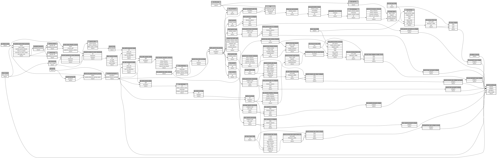

```
# AUTOGENERATED BY ECOSCOPE-WORKFLOWS; see fingerprint in README.md for details

```

```yaml
# fingerprint:
artifacts_sha256_basic: bd37d7e735225322d6804e6fffafdab8ab7890fbbe47a1ddff1dd05f6cdaf16a
artifacts_sha256_strict: b4b67ad57bd260a233088874b7f2072af6c82c5420edd539ab6a3687c83c01eb
installed_requirements:
- channel: https://repo.prefix.dev/ecoscope-workflows/
  name: ecoscope-workflows-core
  version: {version: ==0.19.4}
- channel: https://repo.prefix.dev/ecoscope-workflows/
  name: ecoscope-workflows-ext-ecoscope
  version: {version: ==0.19.4}
params_sha256: c4c392b2f13cc460dfd968d60555f1525ba69425659abaedb02a86c2c7445622
spec_sha256: d0cb59f8f5c5ce424a9192a51eeacb9137d67e509e0d95eab147fcf7a1269fa5

```

# ecoscope-workflows-patrols-workflow


