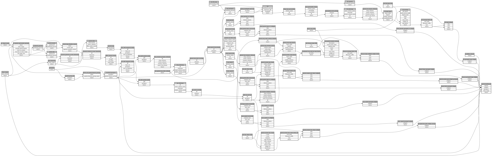

```
# AUTOGENERATED BY ECOSCOPE-WORKFLOWS; see fingerprint in README.md for details

```

```yaml
# fingerprint:
artifacts_sha256_basic: 6fe1bec6b59934b8027aaa34711a3e51b7218726f84f146c8fe1cb662686f72f
artifacts_sha256_strict: 213cfa64c3945a16e2fba8fb1f3366e40e730ada856cef020e86678b9aa7abee
installed_requirements:
- channel: https://repo.prefix.dev/ecoscope-workflows/
  name: ecoscope-workflows-core
  version: {version: ==0.22.13}
- channel: https://repo.prefix.dev/ecoscope-workflows/
  name: ecoscope-workflows-ext-ecoscope
  version: {version: ==0.22.13}
params_sha256: a3e9937048e8fa737f2d3f94d1551ae0cfe4cb598440cbd5e227814b698d7de5
spec_sha256: e17882274db927a8cbec14b0413f7209a4d8e25b460ff3400fbe853b7c0577f0

```

# ecoscope-workflows-patrols-workflow


