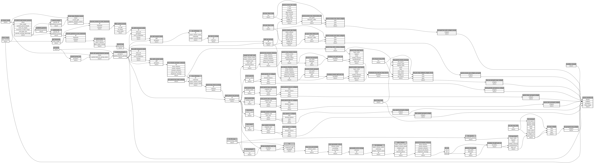

```
# AUTOGENERATED BY ECOSCOPE-WORKFLOWS; see fingerprint in README.md for details

```

```yaml
# fingerprint:
artifacts_sha256_basic: 90cf1c65ff00742dee00f8a2fb5860d9185a915a74d067f4abbe42a697622495
artifacts_sha256_strict: 9973abc730880213dfb8a0c4d081ea399253950d1b7f0d31c86e02f4abbcc1fd
installed_requirements:
- channel: https://repo.prefix.dev/ecoscope-workflows/
  name: ecoscope-platform
  version: {version: ==2.16.0}
- channel: conda-forge
  name: pydeck
  version: {version: ==0.9.2}
params_sha256: 72bfae26223730eacd9d1d382db4ef5878c111206187e3c29163102c2f18fa87
spec_sha256: 8985ccc0c948b3151a470670b96d64c565b19c3edd95a79965e2c0fd99833e16

```

# ecoscope-workflows-patrols-workflow


