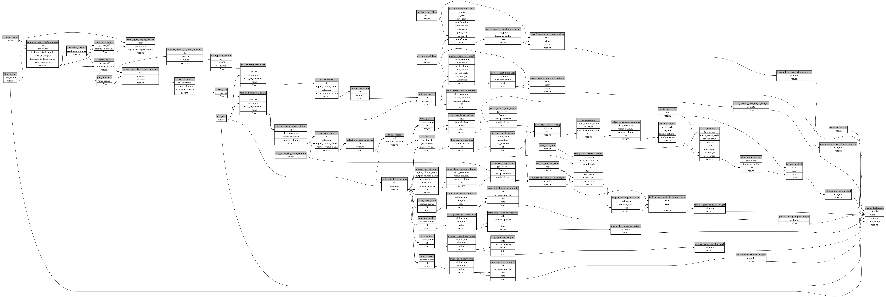

```
# AUTOGENERATED BY ECOSCOPE-WORKFLOWS; see fingerprint in README.md for details

```

```yaml
# fingerprint:
artifacts_sha256_basic: d9561a4e4ae29d5edfce7f7adc0a8c9c2132ff20e1c619a509f763664c90cad1
artifacts_sha256_strict: 560b917b3a84d0aca439a7572cc767fc02a51105dacc5206d3c5f1c3fe676b79
installed_requirements:
- channel: https://repo.prefix.dev/ecoscope-workflows/
  name: ecoscope-workflows-core
  version: {version: ==0.1.0}
- channel: https://repo.prefix.dev/ecoscope-workflows/
  name: ecoscope-workflows-ext-ecoscope
  version: {version: ==0.1.0}
params_sha256: c721b7bcef11bc62557518cbba7306053203e1925c28166e9c2644b8c25a5983
spec_sha256: ecbd725802a99fb92b946848b72bbb70c43a3b41db02aeb5867006e369db100b

```

# ecoscope-workflows-patrols-workflow


